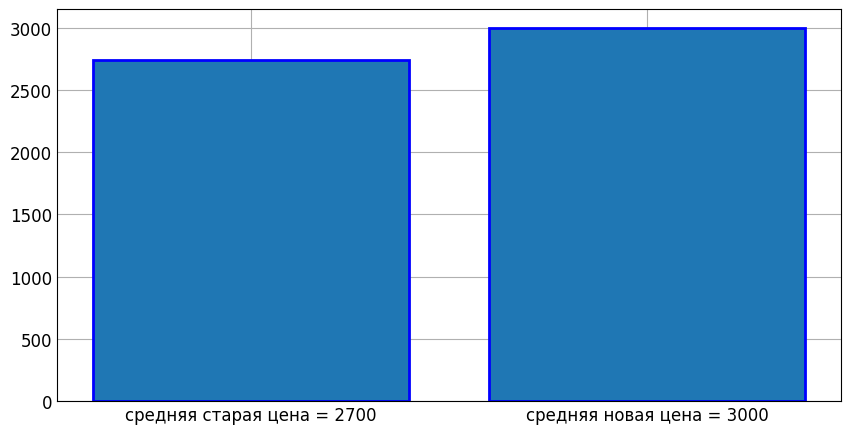
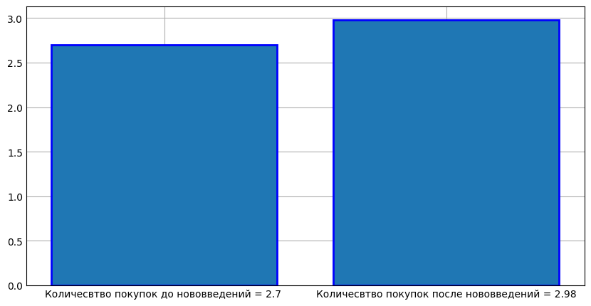

# Анализ эффективности изменений в системе продаж

Этот проект анализирует данные о продажах до и после внедрения новых условий работы, чтобы оценить их эффективность.

## 📌 Цель проекта
Сравнить ключевые метрики продаж:
- Средний чек (сумма продаж)
- UPT (Units Per Transaction - количество товаров в чеке)
до и после изменений в системе продаж.

## 📊 Используемые данные
Данные загружаются из CSV-файла (`data.csv`), который содержит информацию о:
- Суммах продаж
- Количестве товаров в чеках
- Типах доставки
- Условиях продаж (старые/новые)

## 🔍 Методология анализа
1. **Предобработка данных**:
   - Очистка от лишних пробелов и специальных символов
   - Фильтрация по типу доставки ("стандартная" или "самовывоз")
   - Разделение данных на две группы: "старые" и "новые" условия

2. **Расчет метрик**:
   - Средний чек для каждой группы
   - Средний UPT для каждой группы

3. **Визуализация**:
   - Столбчатые диаграммы для наглядного сравнения показателей

## Результаты анализа эффективности

### 1. Сравнение средней цены
На графике ниже показано сравнение средней цены товара **до изменений** и **после изменений**

### 2. Сравнение UPT (Units per Transaction)
На графике показано, как изменилось среднее количество покупок в одной транзакции.  
- До нововведений: ≈ 2.7  
- После нововведений: ≈ 2.98  

